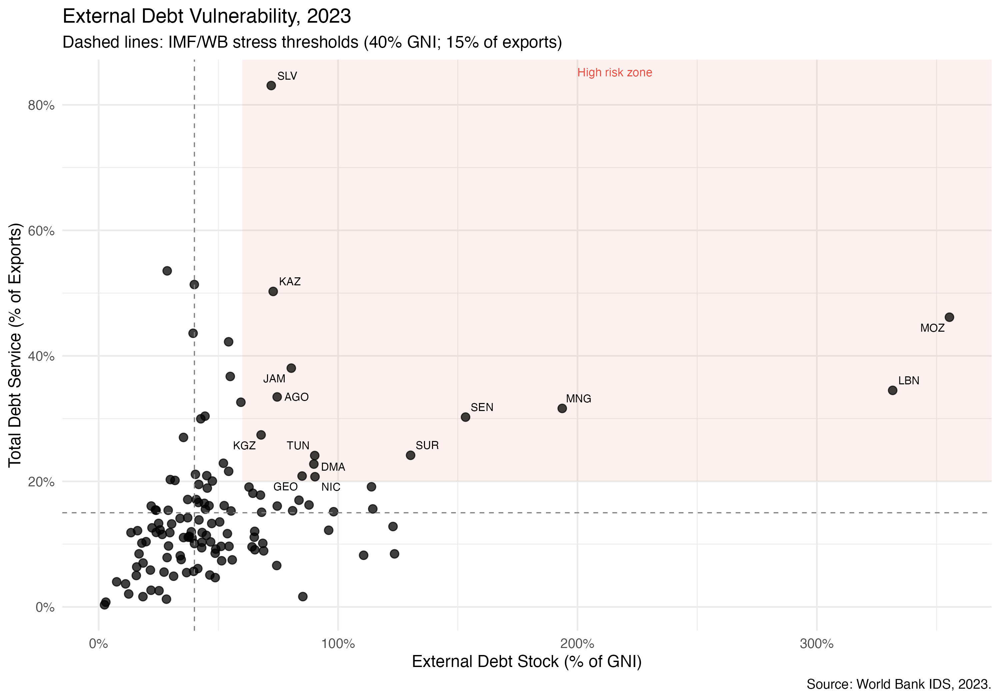
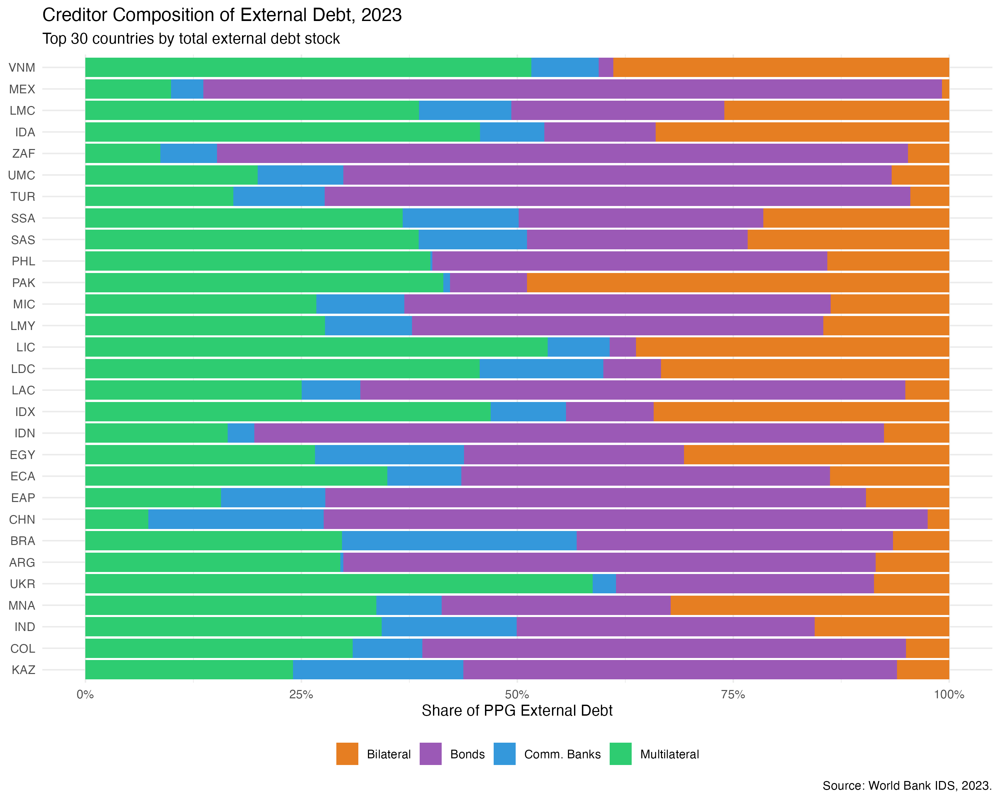
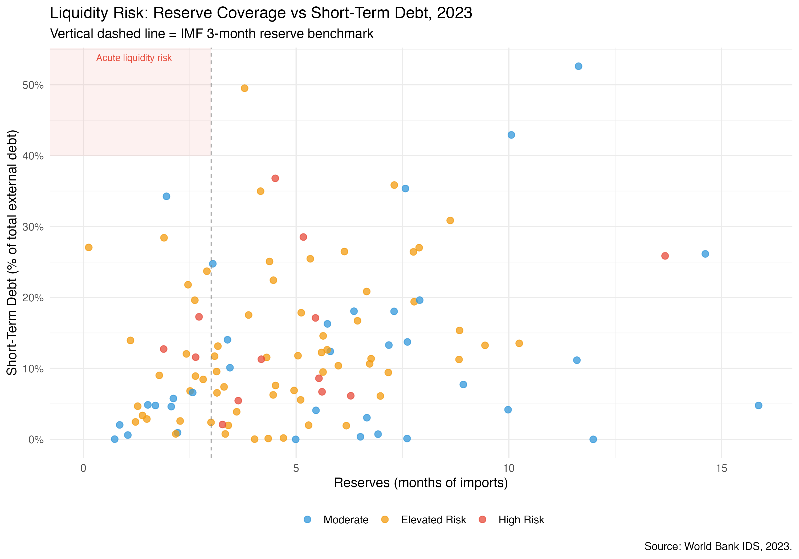
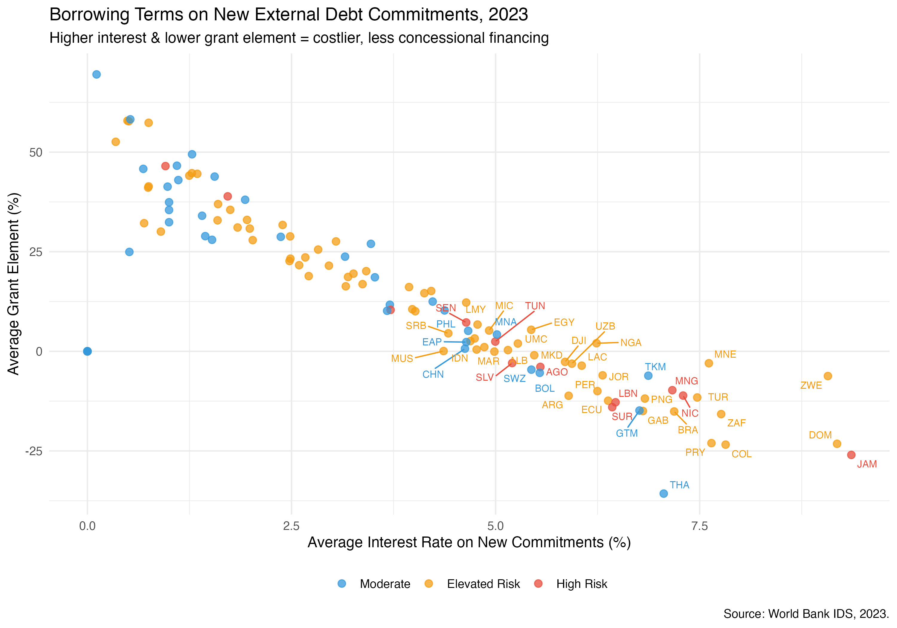

## Executive Summary

This note analyses sovereign debt vulnerability across developing countries using cross-sectional data from the World Bank's International Debt Statistics (IDS) for 2023. The analysis finds that **a substantial share of developing countries — particularly in Sub-Saharan Africa and Latin America — exceed key IMF/World Bank stress thresholds** for external debt. Higher debt burdens, costlier borrowing terms, and elevated short-term debt shares are the primary drivers of debt service pressure. The shift away from concessional multilateral financing toward market-rate instruments is compressing the financial space available to governments and increasing rollover risk. Urgent reforms to the sovereign debt architecture are needed to restore sustainable financing pathways for the most vulnerable countries.

------------------------------------------------------------------------

## 1. Background and Motivation

The global sovereign debt landscape has deteriorated markedly since the COVID-19 pandemic. Rising interest rates in advanced economies, currency depreciations, and slowing growth have compressed fiscal space across the developing world. The number of low- and middle-income countries at high risk of — or already in — debt distress has risen to historically elevated levels, yet the international debt restructuring architecture remains fragmented and slow.

This analysis uses the World Bank's **International Debt Statistics (IDS)** database — the most comprehensive publicly available dataset on external debt stocks, flows, and creditor composition for developing countries — to provide a systematic cross-sectional snapshot of debt vulnerability in 2023. The goal is to identify countries and patterns of concern and to draw policy-relevant conclusions about the evolving structure of developing country debt.

------------------------------------------------------------------------

## 2. Data and Methodology

### 2.1 Data Source

All data are drawn from the **World Bank International Debt Statistics (IDS), 2023**. The IDS covers external debt stocks and flows for low- and middle-income countries, disaggregated by creditor type (multilateral, bilateral, bonds, commercial banks) and debt category (public and publicly guaranteed, private non-guaranteed, short-term).

The following indicators were used:

| Indicator | Code | Description |
|--------------------------|------------------|----------------------------|
| External debt (% GNI) | DT.DOD.DECT.GN.ZS | Primary sustainability ratio |
| Total debt service (% exports) | DT.TDS.DECT.EX.ZS | Debt repayment burden |
| Short-term debt share | DT.DOD.DSTC.ZS | Rollover and liquidity risk |
| Reserves (months of imports) | FI.RES.TOTL.MO | External buffer adequacy |
| Multilateral debt | DT.DOD.MLAT.CD | MDB financing |
| Bilateral debt | DT.DOD.BLAT.CD | Government-to-government lending |
| Bond debt | DT.DOD.PBND.CD | Market financing |
| Commercial bank debt | DT.DOD.PCBK.CD | Private creditor exposure |
| Concessional debt share | DT.DOD.ALLC.CD | Concessionality of portfolio |
| Grant element on new loans | DT.GRE.DPPG | Terms on new commitments |
| Average interest rate | DT.INR.DPPG | Cost of new borrowing |

*Source: World Bank IDS Databank, 2025 edition.*

### 2.2 Country Coverage

The sample covers all low-income, lower-middle-income, and upper-middle-income countries for which data are available in 2023. Aggregate and regional groupings provided by the World Bank are excluded to ensure country-level analysis.

### 2.3 Risk Classification

Countries are classified into three risk tiers based on IMF and World Bank debt sustainability thresholds:

-   **High Risk**: External debt \> 60% of GNI **and** debt service \> 20% of exports
-   **Elevated Risk**: External debt \> 40% of GNI **or** debt service \> 15% of exports
-   **Moderate**: Below both thresholds

### 2.4 Regression Model

To identify the key drivers of debt service burden, an OLS regression was estimated with total debt service (% of exports) as the dependent variable:

$\text{Debt Service}_i = \beta_0 + \beta_1\,\text{Debt/GNI}_i + \beta_2\,\text{Short-term share}_i + \beta_3\,\text{Reserves}_i + \beta_4\,\text{Concessional share}_i + \beta_5\,\text{Grant element}_i + \varepsilon_i$

------------------------------------------------------------------------

## 3. Results

### 3.1 Debt Vulnerability: A Cross-Country View

```{r fig1, fig.cap="Figure 1. External Debt Vulnerability, 2023", out.width="100%"}

```

::: fig-note
Note: Dashed lines indicate IMF/World Bank stress thresholds: 40% GNI (vertical) and 15% of exports (horizontal). Red shading marks the high-risk zone. Country codes label countries classified as High Risk. Source: World Bank IDS, 2023.
:::

Figure 1 plots each country's external debt stock (as a share of GNI) against its total debt service ratio (as a share of exports). Several features stand out:

-   **Lebanon (LBN) and Mozambique (MOZ)** are extreme outliers, with external debt stocks exceeding 300% of GNI and debt service ratios above 30–45% of exports — far beyond any conventional sustainability benchmark.
-   **El Salvador (SLV)** stands out for its acute debt service burden (over 80% of exports) despite a moderate debt stock, reflecting the compressed maturity structure and high interest costs of its dollarised economy.
-   **Mongolia (MNG), Senegal (SEN), and Suriname (SUR)** all sit in or near the high-risk quadrant, consistent with their ongoing engagement with IMF programmes and debt restructuring processes.
-   The majority of countries cluster at debt levels below 60% of GNI, but many already exceed the 15% debt service threshold — indicating that service pressure is widespread even at seemingly moderate stock levels.

::: key-finding
**Finding 1:** Debt service pressure is more widespread than debt stock ratios alone suggest. A significant share of developing countries exceed the 15% export threshold for debt service even when their aggregate debt stocks appear manageable, pointing to unfavourable loan terms and compressed maturities as key drivers.
:::

------------------------------------------------------------------------

### 3.2 Creditor Composition: The Structural Shift Away from Multilaterals

```{r fig2, fig.cap="Figure 2. Creditor Composition of External Debt, Top 30 Countries, 2023", out.width="100%"}

```

::: fig-note
Note: Shows the 30 countries with the largest total external debt stocks. Shares are of public and publicly guaranteed (PPG) external debt. Source: World Bank IDS, 2023.
:::

Figure 2 reveals striking heterogeneity in creditor composition across developing countries:

-   **Bond financing dominates** among upper-middle-income and larger lower-middle-income economies (Argentina, Brazil, Colombia, Mexico, Turkey), where private market access exists but comes at market rates with shorter maturities.
-   **Multilateral creditors** remain the primary source for many lower-income countries — particularly in South Asia and Sub-Saharan Africa — reflecting continued IDA and MDB engagement.
-   **Bilateral creditors** (including China) hold a large share of debt in several Sub-Saharan African countries and in Vietnam, consistent with Belt and Road Initiative (BRI) financing patterns documented elsewhere.
-   The presence of **commercial banks** is most pronounced in East Asia and Latin America, adding an additional layer of private creditor coordination complexity in any future restructuring.

::: key-finding
**Finding 2:** The creditor landscape is highly fragmented. Countries with large bilateral and bond exposures face coordination challenges in any restructuring scenario, as these creditors operate under different legal frameworks and have historically resisted comparable treatment — a core challenge identified in the G20 Common Framework.
:::

------------------------------------------------------------------------

### 3.3 Liquidity Risk: Reserves vs Short-Term Debt

```{r fig3, fig.cap="Figure 3. Liquidity Risk: Reserve Coverage vs Short-Term Debt, 2023", out.width="100%"}

```

::: fig-note
Note: The vertical dashed line marks the IMF's 3-month reserve adequacy benchmark. The red-shaded region indicates acute liquidity risk (low reserves combined with high short-term debt). Source: World Bank IDS, 2023.
:::

Figure 3 plots reserve coverage against the share of external debt that is short-term, providing a liquidity risk lens distinct from the solvency analysis in Figure 1:

-   Several countries hold **fewer than 3 months of import cover** (below the IMF benchmark), making them acutely vulnerable to external shocks or sudden capital flow reversals.
-   Countries with **high short-term debt shares** (above 40%) face significant rollover risk — even if their total debt stock appears manageable, a loss of market access could trigger immediate liquidity distress.
-   Interestingly, several **Moderate-risk countries** (blue) have very low short-term debt shares, reflecting the concessional nature of their borrowing (long-maturity IDA and bilateral loans), while **Elevated-risk countries** cluster at higher short-term shares.

::: key-finding
**Finding 3:** Reserve inadequacy and high short-term debt shares are concentrated among Elevated Risk countries, creating a dangerous combination where any deterioration in market sentiment could rapidly convert a liquidity event into a solvency crisis.
:::

------------------------------------------------------------------------

### 3.4 Borrowing Terms: The Retreat of Concessional Finance

```{r fig4, fig.cap="Figure 4. Borrowing Terms on New External Debt Commitments, 2023", out.width="100%"}

```

::: fig-note
Note: The grant element measures the concessionality of a loan relative to a market reference rate. Negative values indicate loans with above-market interest rates. Labelled countries have particularly high interest rates or very low grant elements. Source: World Bank IDS, 2023.
:::

Figure 4 examines the terms on **new** external debt commitments — a forward-looking indicator of the trajectory of debt sustainability:

-   There is a **strong negative relationship** between average interest rates and grant elements, as expected: higher interest loans carry lower concessionality.
-   Several countries — including **Jamaica (JAM), Zimbabwe (ZWE), Montenegro (MNE), and Dominican Republic (DOM)** — are committing to new debt at interest rates above 7.5% with negative grant elements, meaning they are borrowing on terms **worse than the market reference rate**.
-   Countries in the **Moderate risk** category (blue) tend to cluster at low interest rates and high grant elements, reflecting continued access to IDA and other concessional windows.
-   The **High Risk** group is scattered across the interest rate spectrum, suggesting that even distressed countries retain some access to new borrowing — often at punishing terms.

::: key-finding
**Finding 4:** The retreat of concessional finance is pushing many developing countries into market-rate borrowing at precisely the moment when their debt positions are most fragile. Countries committing to new debt with negative grant elements are locking in a structural deterioration of their debt dynamics.
:::

------------------------------------------------------------------------

## 4. Regression Analysis: Drivers of Debt Service Burden

To disentangle the determinants of debt service pressure, an OLS regression was estimated on the cross-section of developing countries with complete data (n = 111).

### 4.1 Results

\begin{table}[!htbp] \centering 
  \caption{} 
  \label{} 
\begin{tabular}{@{\extracolsep{5pt}}lc} 
\\[-1.8ex]\hline 
\hline \\[-1.8ex] 
 & \multicolumn{1}{c}{\textit{Dependent variable:}} \\ 
\\[-1.8ex] & Debt Service Burden \\ 
\hline \\[-1.8ex] 
 External debt (\% GNI) & 0.084$^{***}$ \\ 
  & (0.022) \\ 
  & \\ 
 Short-term debtshare & $-$0.059 \\ 
  & (0.107) \\ 
  & \\ 
 Reserves(monthsimports) & $-$0.613 \\ 
  & (0.389) \\ 
  & \\ 
 Concessional share & $-$10.209 \\ 
  & (8.086) \\ 
  & \\ 
 Grant element & $-$0.193$^{***}$ \\ 
  & (0.065) \\ 
  & \\ 
 Constant & 19.667$^{***}$ \\ 
  & (3.119) \\ 
  & \\ 
\hline \\[-1.8ex] 
Observations & 111 \\ 
R$^{2}$ & 0.278 \\ 
Adjusted R$^{2}$ & 0.244 \\ 
\hline 
\hline \\[-1.8ex] 
\textit{Note:}  & \multicolumn{1}{r}{$^{*}$p$<$0.1; $^{**}$p$<$0.05; $^{***}$p$<$0.01} \\ 
\end{tabular} 
\end{table} 

### 4.2 Interpretation

Two variables are statistically significant predictors of debt service burden:

**External debt stock (% GNI)** is the strongest and most precisely estimated predictor. A 10 percentage point increase in the debt-to-GNI ratio is associated with an additional **0.84 percentage points** of debt service as a share of exports, holding other factors constant. This confirms that stock accumulation directly translates into service pressure.

**Grant element on new commitments** is the second significant predictor, with a negative sign: a 10 percentage point increase in the grant element on new loans is associated with a **1.93 percentage point reduction** in debt service burden. This finding is particularly policy-relevant — it quantifies the direct benefit of concessional financing for near-term debt sustainability, and underscores the cost of the structural shift toward market-rate borrowing documented in Figure 4.

The **reserve coverage, short-term debt share, and concessional stock share** are in the expected direction but do not reach conventional significance thresholds, likely due to cross-country heterogeneity and the relatively small sample. The concessional share result (-10.2, p = 0.21) is economically substantial and warrants further investigation with a larger or panel dataset.

The model explains **27.8% of the cross-country variation** in debt service ratios — a reasonable fit for a parsimonious cross-sectional specification, and consistent with the expectation that country-specific factors not captured here (exchange rate dynamics, domestic fiscal conditions, debt maturity profiles) also play important roles.

::: key-finding
**Finding 5:** The regression confirms two robust, policy-actionable drivers of debt service burden: (1) the level of debt accumulation, and (2) the terms on which new borrowing is contracted. Countries that maintain access to concessional finance face materially lower service burdens, all else equal — a direct argument for expanding MDB lending capacity and preserving grant windows.
:::

------------------------------------------------------------------------

## 5. Policy Implications

::: policy-box
**1. Strengthen the G20 Common Framework for debt restructuring.** The concentration of bilateral and bond creditors identified in Figure 2 — with heterogeneous legal frameworks and incentive structures — explains the slow pace of restructuring under the Common Framework. Credible burden-sharing rules and tighter timelines for comparability of treatment are essential.
:::

::: policy-box
**2. Expand concessional lending capacity at multilateral development banks.** The regression results directly quantify the fiscal benefit of concessional financing. The ongoing capital adequacy reviews at the World Bank and regional MDBs should prioritise expanding IDA and concessional windows, particularly for countries being priced out of sovereign bond markets.
:::

::: policy-box
**3. Implement early warning systems based on composite indicators.** This analysis demonstrates that debt stock ratios alone are insufficient — countries can face acute service pressure at moderate debt levels if terms are unfavourable or maturities compressed. A composite early warning framework incorporating debt service ratios, reserve adequacy, short-term share, and grant element trends would improve detection of countries approaching distress.
:::

::: policy-box
**4. Address the negative grant element problem urgently.** Several countries identified in Figure 4 are accessing new financing at below-zero grant elements — effectively borrowing on terms worse than market. This is inconsistent with debt sustainability and likely reflects constrained alternatives. Expanding emergency concessional facilities (including IMF RST and MDB crisis windows) would reduce this distortion.
:::

------------------------------------------------------------------------

## 6. Limitations and Extensions

This analysis is cross-sectional and uses a single year (2023), which limits causal inference and the ability to track trajectories. Key extensions would include:

-   **Panel estimation** using IDS data from 2000–2023 to exploit within-country variation and control for unobserved heterogeneity
-   **Creditor-specific analysis** — particularly separating Chinese bilateral lending from Paris Club bilateral creditors, which have very different restructuring dynamics
-   **Domestic debt** — the IDS covers only external debt; domestic debt obligations are not captured but are increasingly relevant for frontier market economies
-   **Integration with IMF DSA outputs** — combining IDS data with IMF Debt Sustainability Analysis classifications would allow validation of the risk flags used here

------------------------------------------------------------------------

## 7. Data and Replication

All data are publicly available from the [World Bank IDS Databank](https://databank.worldbank.org/source/international-debt-statistics). Analysis was conducted in R using the `tidyverse`, `ggplot2`, `scales`, `ggrepel`, and `countrycode` packages. The full replication code is available on request.

------------------------------------------------------------------------
